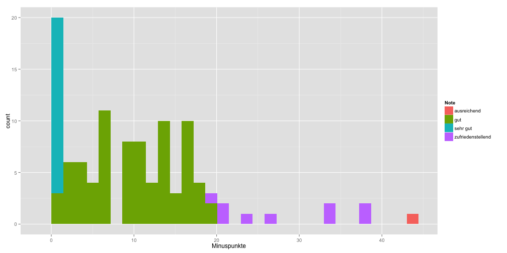

Speise oder Scheisse, Charlottenburg
========================================================

Some preliminary exploration of Charlottenburg restaurant evaluations for #OpenDataDay


```r
opts_chunk$set(message = FALSE, fig.width = 14)
library(ggplot2)
library(plyr)
```


```r
restos = read.csv("~/dev/odd2013/assets/Restaurant-final-Set - Restaurant final Set.csv")
restos = transform(restos, street = aaply(paste(Adresse), 1, function(vec) unlist(strsplit(vec, 
    "[0-9]"))[1]), postal = aaply(paste(Adresse), 1, function(vec) strsplit(unlist(strsplit(paste(vec), 
    ", "))[2], " Berlin")[[1]]), extremes = factor(ifelse(Minuspunkte < quantile(restos$Minuspunkte, 
    0.1, na.rm = TRUE), "best 10%", ifelse(Minuspunkte > quantile(restos$Minuspunkte, 
    0.9, na.rm = TRUE), "worst 10%", "")), levels = c("worst 10%", "best 10%", 
    "")))
restos$Minuspunkte[restos$Note == "sehr gut"] = 0
```

## Distribution of ratings

```r
r = ggplot(data = na.omit(restos), aes(x = Minuspunkte))
r + geom_bar(stat = "bin", aes(fill = Note))
```

 

## Restaurant name + rating by street

```r
r + geom_text(aes(y = street, label = RestaurantName, color = Note))
```

 


